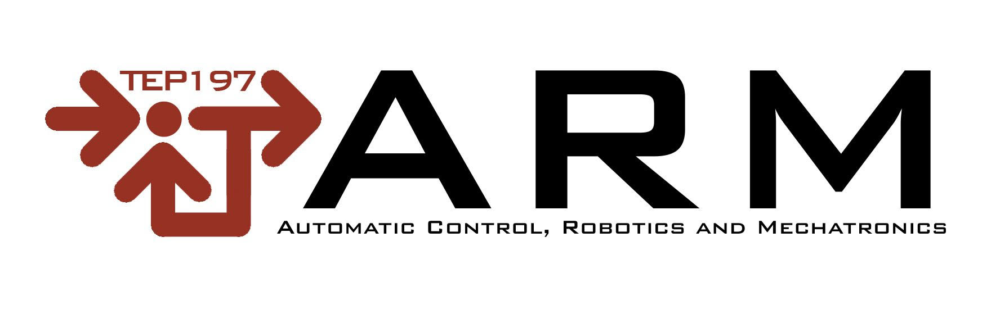

# ROS 2 Tutorial Robotics Students - University of Almería - B. in Informatics Engineering

Repository containing a tutorial to help you understand ROS 2 from scratch in just 4 stages! It is focuses on the morphological and kinematic analysis of mobile robots, as well as the implementation of control and navigation algorithms using the **ROS 2 (Humble/Iron)** middleware and the high-performance **Webots** and **MVSim** simulator.


*Author: Fernando Cañadas Aránega, PhD student in Agriculture Robotics at the University of Almeria, Spain.*

*Gmail: fernando.ca@ual.es*

*Website: https://linktr.ee/FerCanAra*

<a href="https://arm.ual.es/arm-group/"> 
   
</a>
<a href="https://www.linkedin.com/company/automatic-robotics-and-mechatronics-research-group/"> 
   
</a>

> **Note:** Process tested with Linux Ubuntu 22.04.05 LTS on 16th April 2026.

------------------------------------------------------------------------

## Prerequisites

<details>
<summary>Use on native Ubuntu</summary>

- [Linux](https://releases.ubuntu.com/jammy/) (Ubuntu 22.04 recommended).
- [ROS 2 (Humble)](https://docs.ros.org/en/humble/index.html).
- [Environment setup guide](docs/Linux_enviroment_setup.md)

</details>

<details>
<summary>Use on Wndows</summary>

- [Install and configuration vmware pro 17](docs/vmwaresetup.md)

</details>

------------------------------------------------------------------------

## Problem-based learning approach

The programme is divided into four progressive stages:

1.  **Morphological and Kinematic Analysis:** Identification of architectures (Differential vs. Ackermann) and hardware components.
2.  **ROS 2 Environment Setup:** Creation of a structured workspace and dependency management using `rosdep`.
3.  **Perception and Navigation:** Working with simulated sensors, constructing 2D maps, and reactive and deliberative navigation algorithms.
4.  **SLAM with real data:** Working with real sensors to construct three-dimensional environments.

<details>
<summary>1º Stage: Morphological and Kinematic Analysis</summary>
- **Robotic Morphology:** Study and classification of platforms (Differential, Ackermann, submarine and zoomorphic).
- **Hardware Architecture:** Identification of sensors (LiDAR, IMU, Encoders) and their role in environmental perception.
- **Functional Modelling:** Creation of schematics representing the interaction between physical components and logical control.
</details>

<details>
<summary>2º Stage: Morphological and Kinematic Analysis</summary>
- **Installing ROS 2:** Ubuntu 22.04 setup procedure and ROS 2.
- **Managing Workspaces:** Structuring the workspace (`ros2_ws`) and cloning integration repositories.
- **Understanding ROS 2**: using nodes, topics and messages via ```ros2 node list```, ```ros2 topic list``` and ```ros2 topic echo ...```
</details>

<details>
<summary>3º Stage: Simulación, Sensory Perception and Navigation</summary>
- **Webots and MVSim Integration:** Configuring communication between the middleware and the simulator.
- **Monitoring:** Using **Rviz2** to visualise sensor data and transformations (TF) in real time.
- **Data Processing:** Processing information from LiDAR, GPS, IMU, etc.
- **Mapping:** Fundamental concepts of map construction and robot localisation.
- **Control Strategies:** Implementation of **reactive navigation** (obstacle avoidance) and **deliberate navigation** (path planning) algorithms.
</details>

<details>
<summary>4º Stage: Real Environment Data</summary>
- **Real data playback:** Using ros2bag to play back real Ouster OS0 sensor data.
- **3D SLAM:** Using MOLA to perform 3D mapping of the recorded environment in the rosbag.
</details>

------------------------------------------------------------------------

## Tutorial for ROS 2 PBL

<details>
<summary>Exercise 1. Initialising ROS 2</summary>

Open a terminal (`Ctrl+Alt+T`) and execute the following command to initialise the ROS 2 environment variables:
```
source /opt/ros/humble/setup.bash
```
This command must be executed in every new terminal session. To verify the installation, run:
```
echo $ROS_DISTRO
```
In ROS 2, a Node is a discrete process responsible for a specific task (e.g., sensor data acquisition or actuator control). To visualize this, run a publisher node:
```
ros2 run demo_nodes_cpp talker
```
In a second terminal, launch a subscriber node:
```
ros2 run demo_nodes_py listener
```
The "talker" node publishes messages while the "listener" node subscribes to them. You can audit active nodes using:
```
ros2 node list
```
A Topic acts as a communication bus for nodes to exchange messages asynchronously via a publisher/subscriber model. To list active topics, execute:
```
ros2 topic list
```
To inspect the message type associated with a specific topic (e.g., /chatter):
```
ros2 topic type /chatter
```
ROS 2 provides tools to monitor and interact with the data stream in real-time:
- Monitor messages: View live data circulating through a topic:
```
ros2 topic echo /chatter
```
- Manual injection: Publish a custom message directly from the CLI:
```
ros2 topic pub /chatter std_msgs/msg/String "data: 'Hello ROS'"
```
- Performance analysis: Measure the publishing frequency (Hz) to estimate system latency:
```
ros2 topic hz /chatter
```
</details>

<details>
<summary>Exercise 2. Interaction with simulators and visualisers in ROS</summary>

Once the core ROS 2 concepts are understood, the next stage involves interacting with complex packages within the ROS ecosystem. This section focuses on deploying a mobile robot simulator to analyze sensor data and visualization tools.

Execute the following launch file to start the environment:
```
ros2 launch mvsim demo_jackal.launch.py
```
Upon execution, MVsim emerge (MVSim is a lightweight, realistic 2D engine for mobile robotics. In the default scene, you will observe):


where:

- Yellow Robot: A Jackal unmanned ground vehicle (UGV).
- Blue Cubes: Obstacles (some in motion) for collision avoidance testing.
- Black Lines: Real-time 2D LiDAR scan rays measuring distances.
- Blue Points: 3D point cloud data generated by an RGB-D camera.

Also, RViz is a 3D visualizer that displays data exchanged within the ROS system. Unlike the simulator, RViz does not calculate physics; it only renders what the robot "perceives".


Key elements in the Displays panel:
- RGB: Visual feed from the robot’s camera.
- LaserScan: Graphical representation of LiDAR measurements.
- RGBD Cloud: Detailed 3D point cloud from the depth sensor.
- TF (Transform Tree): Displays the spatial relationship and hierarchy between the robot's reference frames and its sensors.

To validate the system's dynamic response:

- Focus your mouse on the MVSim window.
- Press the W key to move the robot forward.
- Observe how the sensor data (LiDAR and Point Clouds) updates in real-time within RViz as the robot interacts with the environment.

</details>


